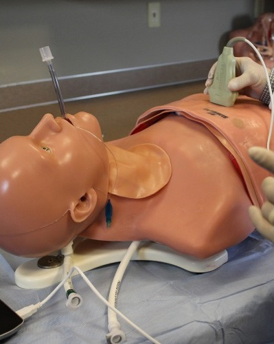
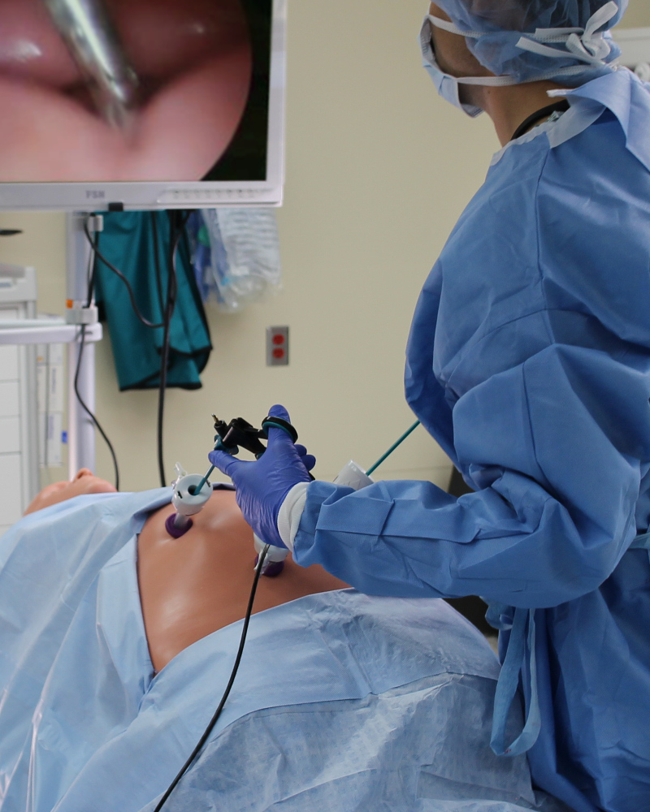
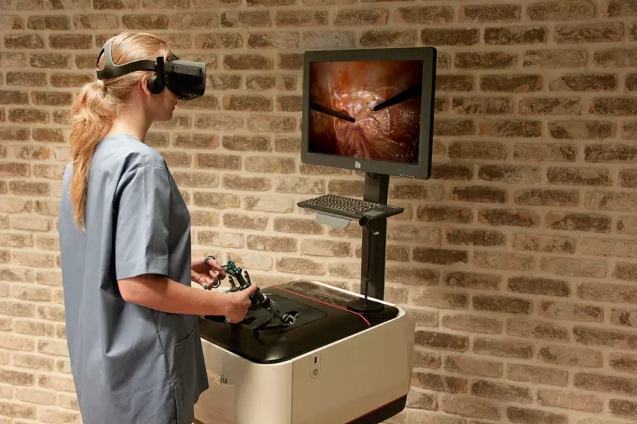
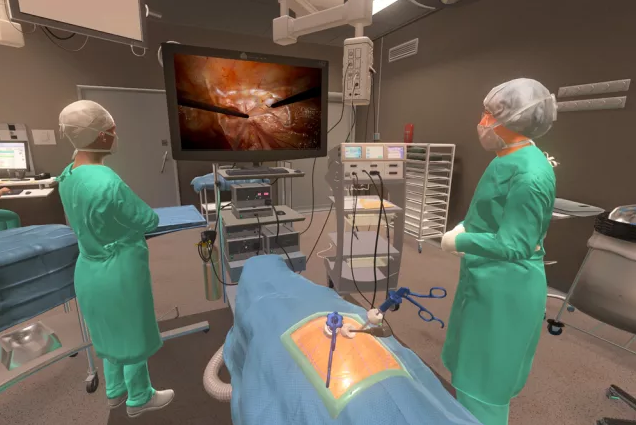
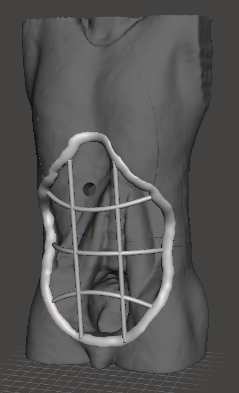
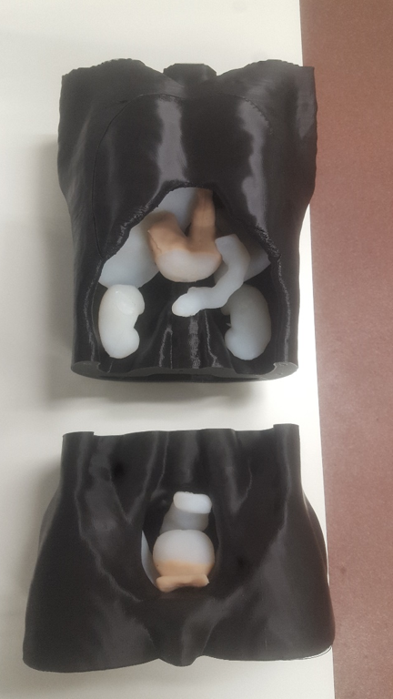
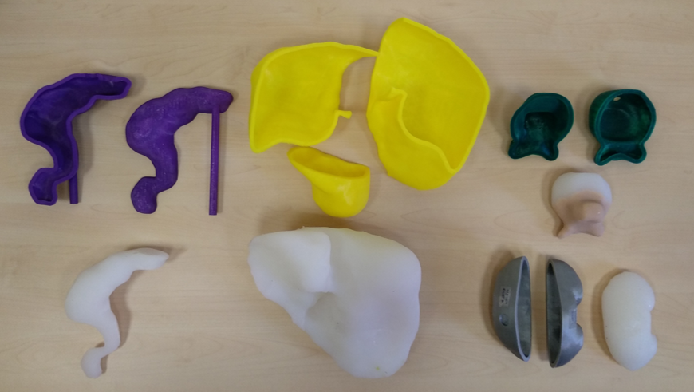
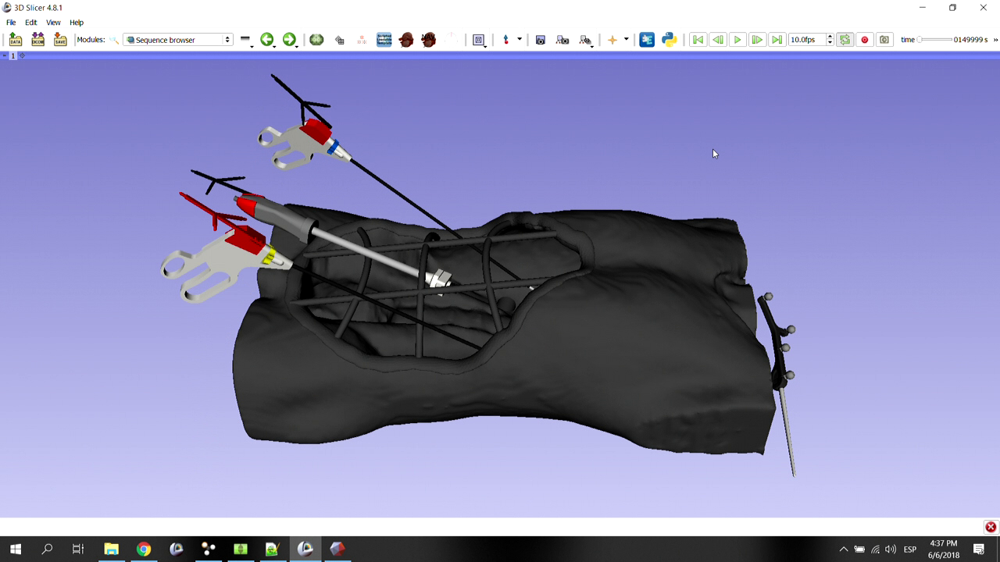
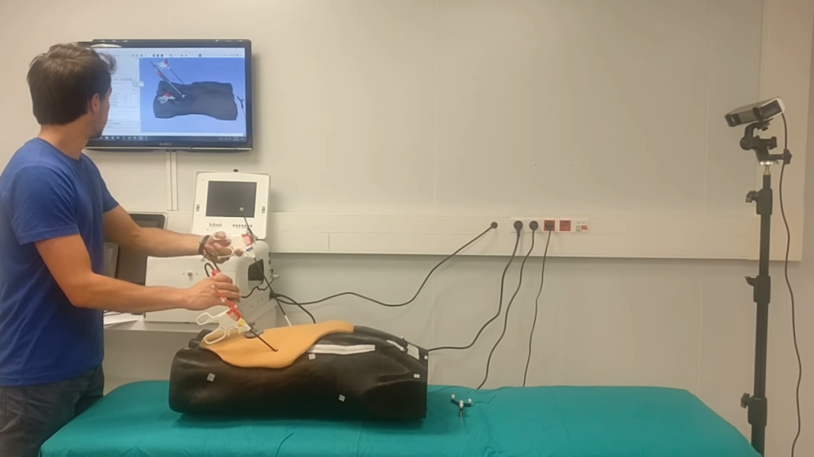

# 3D-printed system for image-guided surgery

This repository contains a general overview of my [thesis in Biomedical Engineering](https://drive.google.com/file/d/1sMrFVx88sWUhP7toCpTKhsKqrg7txSBO/view) at the University of Carlos III, Madrid.

## Background and Motivation

Surgical training and research depend on either clinical, animal or phantom studies. The first two options provide the most realistic environment, but they present serious ethical, economic and regulatory barriers.

On the other side, phantoms provide a consistent and cost-effective solution, especially advantageous for use in early stages of device development or medical training. When combined with specific training software, they constitute an effective learning platform for disciplines such as image-guided surgery or minimally invasive procedures.

	
	
	

Several training systems based on the use of phantoms have been developed for a variety of applications, from open-source platforms for training of ultrasound-guided needle insertions, to virtual reality applications that simulate the environment of an operating theatre.

	
	

The goal of this project was to develop a thorough system for training of laparoscopic skills, including:

(i) An anthropomorphic torso phantom, with special focus on inexpensiveness and customization possibilities.

(ii) A realistic image-guided surgery setup for real time navigation and recording of activity.

## Materials and Methods

Fused deposition modelling 3D printing technology was used to produce the full-scale torso (comprised of thorax, pelvis and chest parts) and reusable organ molds, employed for silicone casting and generation of the organs. Artificial skin was also created for the abdominal area, consisting of a 3D-printed framework and an ethylene-vinyl acetate foam sheet.

	
	
	
	
	

An optical tracking system (OptiTrack Duo) and retroreflective fiducial markers were used together with the visualization software Slicer for navigation of the phantom.

	

## Results

Two subjects evaluated the perceived level of realism and accuracy of the system.

The results proved that all components of the full-scale phantom fit together seamlessly, and the training software effectively allowed real-time navigation of the phantom, which provided a realistic feeling of surgical immersion.

<i>Please click on the image for a Youtube link to final system demonstration<i>

